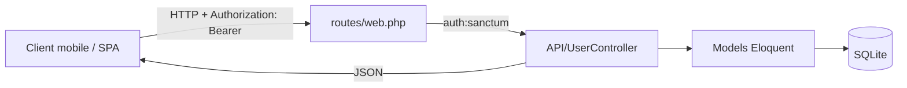

# Water App Backend


Backend API Laravel pour gérer des utilisateurs, leur consommation d’eau (par jour), leurs abonnements et leurs notifications.

Le cœur fonctionnel est concentré dans un seul contrôleur ([`app/Http/Controllers/API/UserController.php`](app/Http/Controllers/API/UserController.php)) et des routes “API” déclarées dans [`routes/web.php`](routes/web.php) (plutôt que `routes/api.php`). L’authentification se fait via des tokens personnels Laravel Sanctum, appliqués par le middleware `auth:sanctum` sur les routes protégées ([`routes/web.php`](routes/web.php)).

## Vue d’ensemble (en 30 secondes)

| Sujet | Choix | Où regarder |
|---|---|---|
| Routes API | Routes déclarées dans `web.php` (pas de `api.php`) | [`routes/web.php`](routes/web.php) |
| Auth | Bearer token via Sanctum (`auth:sanctum`) | [`config/auth.php`](config/auth.php), [`config/sanctum.php`](config/sanctum.php) |
| Persistance | SQLite par défaut | [`config/database.php`](config/database.php), [`database/migrations/`](database/migrations/) |
| Domaine | Consommations, abonnements, notifications | [`app/Models/`](app/Models/), [`app/Http/Controllers/API/UserController.php`](app/Http/Controllers/API/UserController.php) |
| Assets | Vite + intégration Laravel | [`vite.config.js`](vite.config.js), [`resources/`](resources/) |

## Schéma rapide



## Techniques intéressantes (présentes dans le code)

| Technique | Pourquoi ça compte | Où dans le repo |
|---|---|---|
| Auth par token via [`Authorization`](https://developer.mozilla.org/en-US/docs/Web/HTTP/Headers/Authorization) | API simple à consommer (mobile/SPA), pas de session côté client | [`app/Http/Controllers/API/UserController.php`](app/Http/Controllers/API/UserController.php), [`database/migrations/2024_05_21_143016_create_personal_access_tokens_table.php`](database/migrations/2024_05_21_143016_create_personal_access_tokens_table.php) |
| Verbes HTTP ([MDN Methods](https://developer.mozilla.org/en-US/docs/Web/HTTP/Methods)) + statuts ([MDN Status](https://developer.mozilla.org/en-US/docs/Web/HTTP/Status)) | Contrats d’API lisibles et testables | [`routes/web.php`](routes/web.php), [`app/Http/Controllers/API/UserController.php`](app/Http/Controllers/API/UserController.php) |
| Validation d’entrées côté serveur | Réduit les écritures incohérentes et simplifie le debug | [`app/Http/Controllers/API/UserController.php`](app/Http/Controllers/API/UserController.php) |
| Exceptions CSRF (référence : [CSRF](https://developer.mozilla.org/en-US/docs/Web/Security/Attacks/CSRF)) | Pratique pour endpoints JSON appelés hors navigateur | [`bootstrap/app.php`](bootstrap/app.php) |
| Accesseurs de modèle (`formatted_date`) | Normalise des valeurs exposées par l’API | [`app/Models/ConsommationJournaliere.php`](app/Models/ConsommationJournaliere.php), [`app/Models/notification.php`](app/Models/notification.php) |
| Modules ES ([MDN Modules](https://developer.mozilla.org/en-US/docs/Web/JavaScript/Guide/Modules)) + Vite | Build rapide et intégration propre avec Laravel | [`resources/js/app.js`](resources/js/app.js), [`resources/js/bootstrap.js`](resources/js/bootstrap.js), [`vite.config.js`](vite.config.js) |

## Technologies / libs “non évidentes” (à connaître)

| Tech | Rôle | Lien |
|---|---|---|
| Laravel 11 | Framework backend | https://laravel.com |
| Laravel Sanctum | Auth API via tokens | https://laravel.com/docs/11.x/sanctum |
| Carbon | Dates/formatage côté PHP | https://carbon.nesbot.com |
| Vite | Bundler côté front | https://vitejs.dev |
| `laravel-vite-plugin` | Pont Laravel ↔ Vite | https://github.com/laravel/vite-plugin |
| Axios | Client HTTP JS | https://axios-http.com |
| `fruitcake/php-cors` | Support CORS (dépendance Laravel) | https://github.com/fruitcake/php-cors |
| Tailwind CSS | CSS (présent dans la page welcome) | https://tailwindcss.com — voir [`resources/views/welcome.blade.php`](resources/views/welcome.blade.php) |
| Figtree (Bunny Fonts) | Police (référence dans `welcome`) | https://fonts.bunny.net/css?family=figtree:400,600&display=swap |

## Aperçu des endpoints

Source de vérité : [`routes/web.php`](routes/web.php)

| Méthode | URL | Auth | Contrôleur / action |
|---|---|---|---|
| POST | `/register` | Non | `UserController@register` |
| POST | `/login` | Non | `UserController@login` |
| GET | `/fakeConsommations` | Non | `UserController@addFakeConsommation` |
| POST | `/logout` | `auth:sanctum` | `UserController@logout` |
| GET | `/users/me` | `auth:sanctum` | `UserController@show` |
| GET | `/users/consommation` | `auth:sanctum` | `UserController@getLastSevenConsumptions` |
| POST | `/users/consommation` | `auth:sanctum` | `UserController@addConsommation` |
| GET | `/users/abonnement` | `auth:sanctum` | `UserController@getAbonnement` |
| POST | `/users/abonnement` | `auth:sanctum` | `UserController@addAbonnement` |
| GET | `/users/notifications` | `auth:sanctum` | `UserController@getNotifications` |
| POST | `/users/notifications` | `auth:sanctum` | `UserController@addNotification` |
| REST | `/users` | `auth:sanctum` | `Route::apiResource('users', ...)` (sauf `show`) |

> Note : ces endpoints sont déclarés dans [`routes/web.php`](routes/web.php). Ça marche, mais ça mélange “web” et “API”. Si tu veux isoler l’API plus tard, `routes/api.php` est l’emplacement standard.

## Données (schéma extrait)

| Table | Description | Champs clés | Migration |
|---|---|---|---|
| `users` | Identité + auth | `email`, `tel`, `id_compteur` uniques | [`database/migrations/0001_01_01_000000_create_users_table.php`](database/migrations/0001_01_01_000000_create_users_table.php) |
| `personal_access_tokens` | Tokens Sanctum | `tokenable`, `token`, `abilities` | [`database/migrations/2024_05_21_143016_create_personal_access_tokens_table.php`](database/migrations/2024_05_21_143016_create_personal_access_tokens_table.php) |
| `consommation_journaliere` | Conso par date | `user_id`, `date`, `consommation` | [`database/migrations/2024_05_21_173933_consommation_journaliere.php`](database/migrations/2024_05_21_173933_consommation_journaliere.php) |
| `abonnements` | Abonnement courant | `user_id`, `titre`, `total`, `consommation` | [`database/migrations/2024_05_22_125827_create_abonnements_table.php`](database/migrations/2024_05_22_125827_create_abonnements_table.php) |
| `notifications` | Historique de notifications | `user_id`, `type`, `message` | [`database/migrations/2024_05_23_072311_create_notifications_table.php`](database/migrations/2024_05_23_072311_create_notifications_table.php) |

## Structure du projet

```text
.
├─ app/
│  ├─ Http/
│  │  └─ Controllers/
│  │     └─ API/
│  ├─ Models/
│  └─ Providers/
├─ bootstrap/
├─ config/
├─ database/
│  ├─ factories/
│  ├─ migrations/
│  └─ seeders/
├─ public/
│  ├─ build/        (généré par Vite, peut ne pas exister au repo)
│  └─ storage/      (souvent un lien vers `storage/app/public`)
├─ resources/
│  ├─ css/
│  ├─ js/
│  └─ views/
├─ routes/
├─ storage/
│  ├─ app/
│  │  └─ public/    (uploads/fichiers publics)
│  ├─ framework/
│  └─ logs/
├─ tests/
├─ .env.example
├─ artisan
├─ composer.json
├─ package.json
├─ phpunit.xml
└─ vite.config.js
```

Dossiers à regarder en premier :
- [`routes/`](routes/) : définition des endpoints (ici dans `web.php`).
- [`app/Http/Controllers/API/`](app/Http/Controllers/API/) : logique API (auth, consommation, abonnement, notifications).
- [`database/migrations/`](database/migrations/) : schéma SQLite (users, tokens Sanctum, consommations, abonnements, notifications).
- [`bootstrap/`](bootstrap/) : configuration Laravel 11 (dont exceptions CSRF dans `app.php`).
